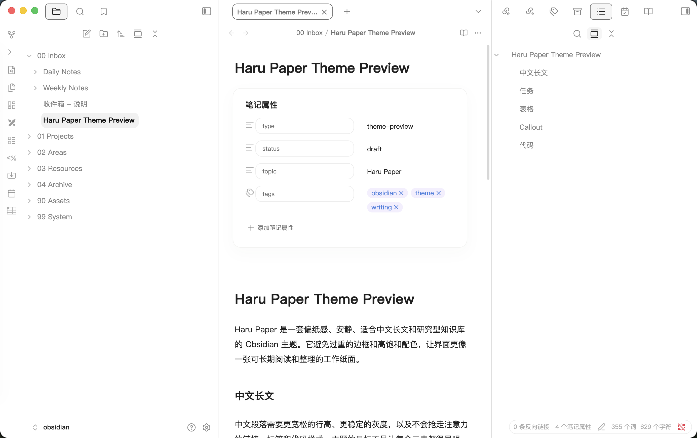

# Haru Paper

A soft paper-like Obsidian theme for Chinese long-form writing, research notes, and calm macOS-style workspaces.



## Features

- Soft paper-inspired light interface with quiet macOS-like chrome.
- Comfortable Chinese long-form reading with generous line height and stable text contrast.
- Calm sidebars and outline panels designed for research-heavy vaults.
- Airy tables, inline code, tags, callouts, and metadata styling.
- Theme Style Settings support for editor width, body font size, sidebar density, and accent color.

## Installation

### From Obsidian Community Themes

Once published, open Obsidian and go to:

`Settings -> Appearance -> Themes -> Manage`

Search for `Haru Paper`, then install and enable it.

### Manual Installation

1. Download this repository.
2. Copy `theme.css` and `manifest.json` into:

```text
<your-vault>/.obsidian/themes/Haru Paper/
```

3. In Obsidian, open `Settings -> Appearance -> Themes`.
4. Select `Haru Paper`.

## Recommended Setup

- Obsidian light mode.
- macOS system fonts or PingFang SC for Chinese writing.
- Style Settings plugin, if you want to adjust width, text size, and accent color.

## Notes

This repository contains the theme CSS only. Any local helper plugin used in the author's personal vault is separate from the theme package.

## License

MIT
